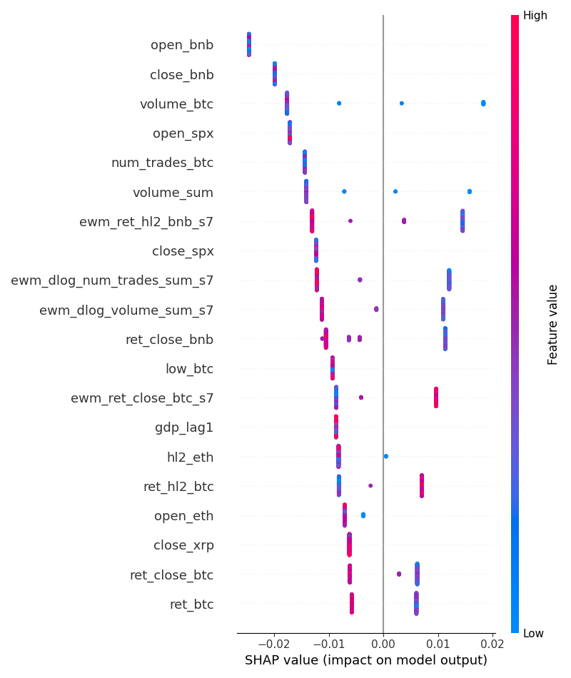
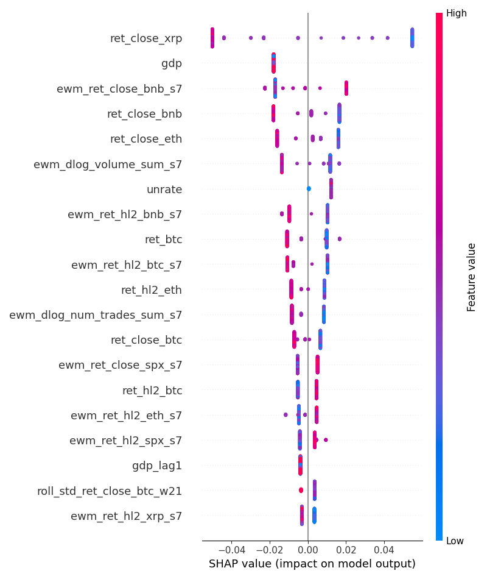

# SHAP Analysis Report

## Initial Feature Analysis

Below is the SHAP summary plot for all candidate features. Several variables appear as straight vertical lines centered at zero. This pattern indicates that these features have a negligible impact on the model's output, regardless of whether their values are low (blue) or high (red). They introduce noise rather than predictive signal and should be eliminated.

The features identified for removal are:
- `open_bnb`, `open_spx`, `open_eth`
- `close_bnb`, `close_spx`, `close_xrp`
- `low_btc`
- `num_trades_btc`
- `gdp_lag1`
- `hl2_eth`

## Further Analysis
Below is the SHAP summary plot following the exclusion of the previously identified non-predictive features. The refined model demonstrates improved performance, achieving a lower Mean Squared Error (MSE) of 0.01681.

We can notice that we can still remove a few features:
- `gdp`
- `unrate`
- `unrate_lag1`
- `roll_std_ret_close_btc_w21`

## Even further analysis?

At this stage we seem to have eliminated any features that the model doesn't seem to underestand. This has improved the model performance, but not significantly, current MSE is 0.01674.

